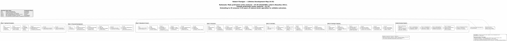

# Life Plan Tracker

A lifetime development tracking system for children (ages 0–35). It tracks six pillars of development (Spiritual, Financial, Education & Career, Character, Life Skills, Heritage & Identity), a family economy with behavior-gated bounties, a wishlist, and pre-loaded milestones drawn from a structured set of planning documents. The system accounts for prefrontal cortex maturation differences between males (~25–30) and females (~21–24), extending the framework to age 35 to validate outcomes over a meaningful post-maturation window.

Instead of a generic chore chart or a college fund spreadsheet, this is a full navigation system. You define milestones, track character development, manage an earned-income economy, and maintain a living record that the child inherits as a map — not just money.



## How to Use It

### Starting the App

```bash
cd app/backend
pip install -r requirements.txt
uvicorn main:app --host 0.0.0.0 --port 8000 &
```

Open **http://localhost:8000** in any browser (desktop or phone).

Default login: `admin` / `changeme`

### First-Time Setup

1. Log in as admin
2. Click **+ New Profile** and enter the child's name and date of birth
3. The system automatically seeds 122 milestones across all 8 pillars from the planning documents
4. Click the profile card to enter the Lifetime Development Dashboard

### Navigating the Dashboard

After selecting a profile, you see:

- **Profile header** with name, current age, and developmental phase (Foundation/Exploration/Formation/Launch/Consolidation/Stewardship)
- **8 pillar cards** with progress bars showing completion percentage
- **💵 Bounty Board** card for the family economy system
- **Roadmap** showing per-phase progress across all pillars with the current phase highlighted

### Working with Pillars

Click any pillar card to see:

- **Milestones grouped by age band** (0–5, 6–12, 13–18, 18–25, 25–35)
- **Status toggle** on each milestone: ○ Pending → ◐ In Progress → ● Complete
- **✎ Edit button** to modify title or add notes to any milestone
- **× Delete button** to remove milestones that don't apply
- **+ Milestone** to create new goals with an age band
- **+ Note** to add freeform observations/records

### Bounty Board (Family Economy)

The 💵 Bounty Board has four sections:

**Eligibility Banner** — Shows current tier (Bronze/Silver/Gold/Platinum) based on behavior scores.

**Earnings Summary** — Total earned, paid out, pending payout, bounties completed.

**Behavior Matrix** — Score 6 character traits weekly (Integrity, Honesty, Responsibility, Respect, School Effort, Citizenship) on a 1–5 scale. The average determines tier eligibility:
- ≥ 4.5 → Platinum (can propose projects, negotiate rates)
- ≥ 3.5 → Gold (larger projects requiring skill)
- ≥ 2.5 → Silver (property and organization tasks)
- < 2.5 → Bronze (household help at entry level)

**Bounties** — Create tasks by tier with dollar amounts. Status cycles: Available → Claimed → Complete → Paid.

**🎁 Wishlist** — The child adds items they want to save toward. Each shows a progress bar based on total earnings vs. item cost. Status: 💭 Saving → 👍 Approved → ✓ Purchased.

### User Roles

| Role | Who | Can Do |
|------|-----|--------|
| `admin` | Parent | Full CRUD on all profiles, manage users, score behavior, manage bounties |
| `child` | The child | View own profile, add notes, claim bounties, manage wishlist |
| `readonly` | Grandparents, family | View assigned profiles only |

Admins create other users via the API at `/docs` (Swagger UI) using POST `/api/auth/register`.

### Data Persistence

All data lives in `app/backend/life_plan.db` (SQLite). This file persists across restarts. Do not delete it unless you want to reset everything.

### Mobile Access

The app is responsive. On a phone, navigate to `http://<your-machine-ip>:8000` and bookmark it to the home screen. It works as a pseudo-app with no install required.

## Project Structure

```
life_plan/
├── README.md
├── raw.txt                          # Original planning notes
├── docs/                            # Structured planning documents
│   ├── 00_lifetime_development_dashboard.md
│   ├── 01_career_guidance_template.md
│   ├── 02_consequence_analysis.md
│   ├── 03_family_economy_system.md
│   ├── 04_bounty_framework.md
│   ├── 05_heritage_identity.md
│   ├── 06_environmental_resilience.md
│   ├── 07_spiritual_warfare_discernment.md
│   └── 08_power_of_language.md
├── diagrams/                        # PlantUML source + rendered PNGs
│   ├── poster_lifetime_map.puml     # Full 0–35 poster (also .png, .svg)
│   ├── brain_maturation.puml
│   ├── pillars_detail.puml
│   ├── family_economy.puml
│   ├── heritage_identity.puml
│   └── financial_targets.puml
└── app/
    ├── backend/
    │   ├── main.py                  # FastAPI entry point
    │   ├── models.py                # SQLAlchemy models
    │   ├── schemas.py               # Pydantic request/response schemas
    │   ├── auth.py                  # JWT + role-based access
    │   ├── database.py              # DB connection
    │   ├── seed_data.py             # 122 milestones from docs
    │   ├── requirements.txt
    │   └── routes/
    │       ├── users.py             # Auth + user management
    │       ├── profiles.py          # Profile CRUD + milestone seeding
    │       ├── pillars.py           # Pillar entry CRUD
    │       └── economy.py           # Behavior, bounties, wishlist, earnings
    └── frontend/
        ├── index.html
        ├── package.json
        ├── vite.config.js
        └── src/
            ├── App.jsx
            ├── main.jsx
            ├── services/
            │   ├── auth.js
            │   └── api.js
            └── pages/
                ├── Login.jsx
                ├── Dashboard.jsx
                ├── Profile.jsx
                └── Economy.jsx
```

## Rendering Diagrams

The `diagrams/` folder contains PlantUML source files. To re-render after edits:

```bash
PLANTUML_LIMIT_SIZE=16384 JAVA_TOOL_OPTIONS="-Djava.awt.headless=true" \
  java -jar ~/.local/lib/plantuml.jar -tpng diagrams/*.puml
```

The poster SVG scales to any print size:
```bash
java -jar ~/.local/lib/plantuml.jar -tsvg diagrams/poster_lifetime_map.puml
```

## Neuroscience Basis (Why 0–35)

The framework extends to age 35 rather than stopping at 18 or 25 because:

- **Male prefrontal cortex** matures ~25–30 (Giedd, NIH longitudinal study; Lebel & Beaulieu, 2011)
- **Female prefrontal cortex** matures ~21–24 (Ingalhalikar et al., U. Penn, 2014)
- Extending to 35 provides 5–10 years of **mature-brain operation** to validate that the system produced sound judgment — not just early lucky outcomes

See `diagrams/brain_maturation.puml` and `docs/06_environmental_resilience.md` for full detail.

## API Documentation

Once the server is running, interactive API docs are available at **http://localhost:8000/docs** (Swagger UI).
