# Life Plan Tracker

A lifetime development tracking system for children (ages 0–35). It tracks 14 pillars of development, 10 structured programs, 10 discernment categories, a family economy with behavior-gated bounties (10 tiers from Bronze to Ironforged), streaks, diminishing-returns decay, and 540+ pre-loaded milestones drawn from structured planning documents. The system accounts for prefrontal cortex maturation differences between males (~25–30) and females (~21–24), extending the framework to age 35 to validate outcomes over a meaningful post-maturation window.

The dashboard answers one question: **"Is this child becoming a wise, capable, kind, and independent person?"**

Instead of a generic chore chart or a college fund spreadsheet, this is a full navigation system. You define milestones, track character development, manage an earned-income economy with programs worth up to $48K in total rewards, maintain discernment journals that deepen over time, and build a living record that the child inherits as a map — not just money.

## Overview

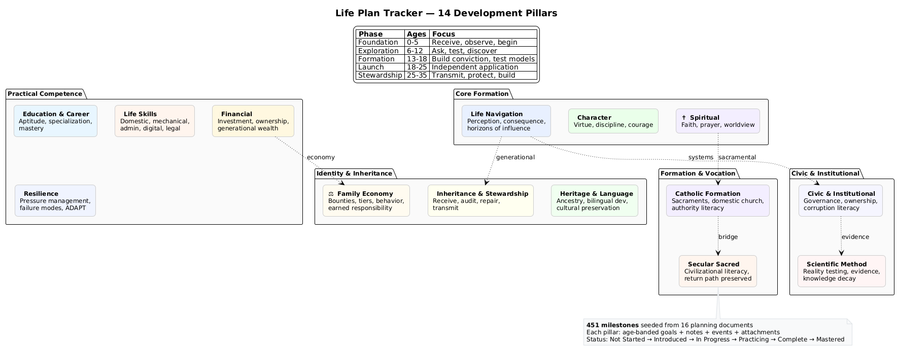

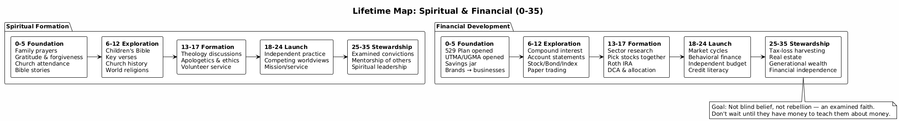

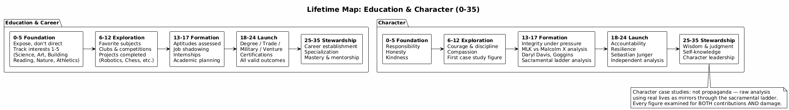

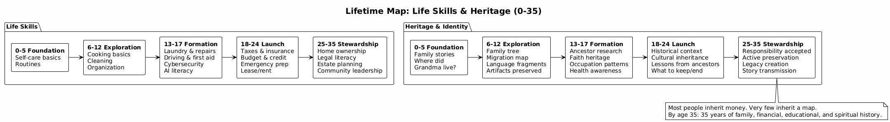

## Neuroscience Basis (Why 0–35)

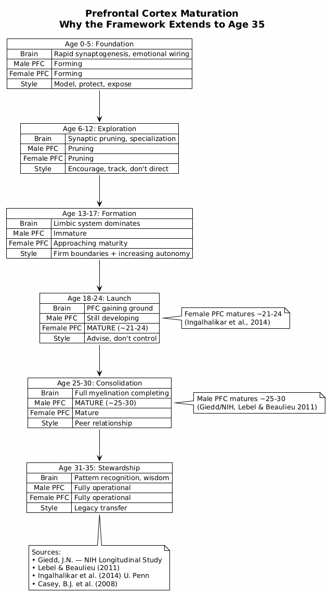

The framework extends to age 35 rather than stopping at 18 or 25 because:

- **Male prefrontal cortex** matures ~25–30 (Giedd, NIH longitudinal study; Lebel & Beaulieu, 2011)
- **Female prefrontal cortex** matures ~21–24 (Ingalhalikar et al., U. Penn, 2014)
- Extending to 35 provides 5–10 years of **mature-brain operation** to validate that the system produced sound judgment — not just early lucky outcomes

## Family Economy

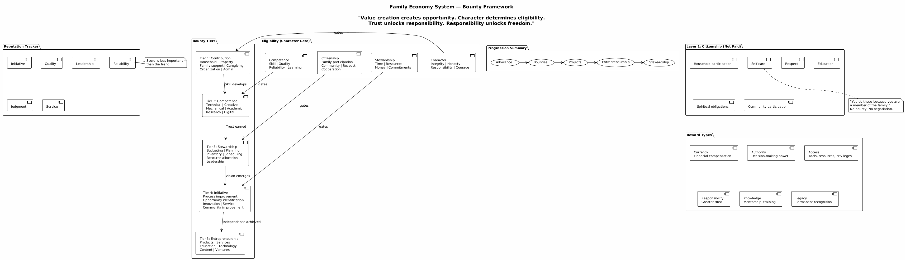

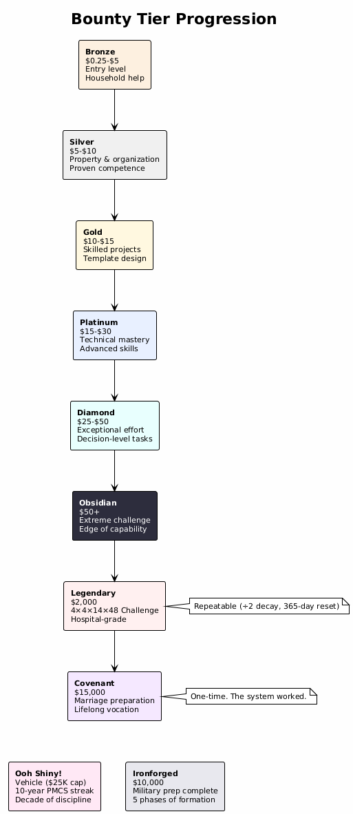

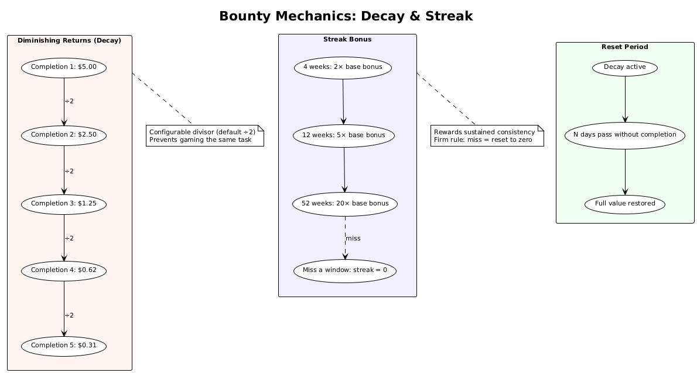

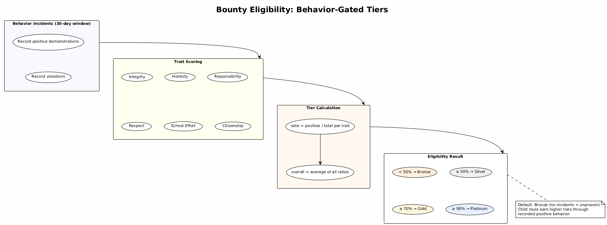

## Programs

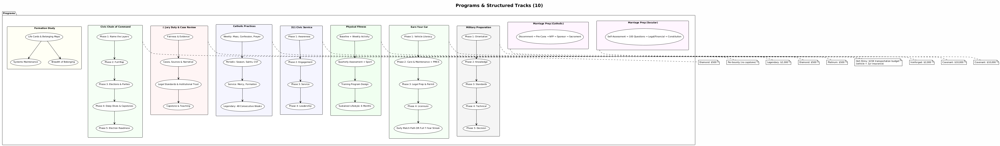

## Financial Targets & Investment Education

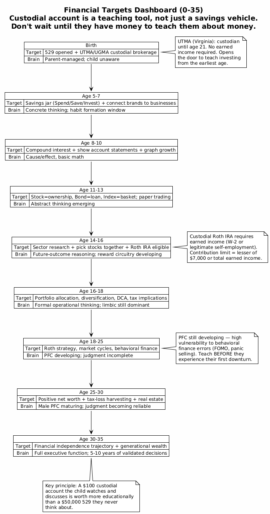

## Heritage & Identity

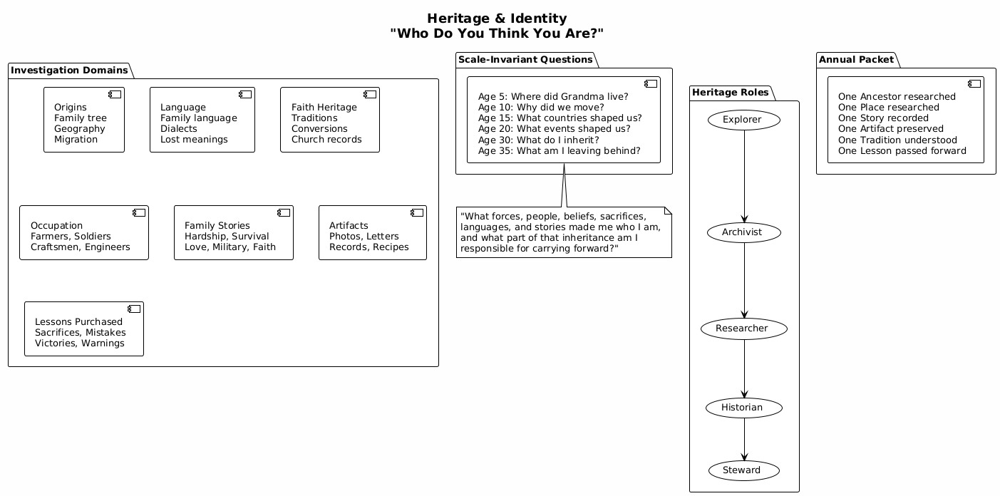

---

## How to Use It

### Starting the App

**Prerequisites:**
- Python 3.12+
- Node.js 18+ (for building the frontend)
- Java 11+ (only if re-rendering diagrams)

**First-time setup:**

```bash
# Clone the repo
cd life_plan

# Create Python virtual environment
python -m venv .venv
source .venv/bin/activate

# Install backend dependencies
cd app/backend
pip install -r requirements.txt

# Build the frontend
cd ../frontend
npm install
npm run build
cd ../backend
```

**Run the application:**

```bash
cd app/backend
source ../../.venv/bin/activate
uvicorn main:app --host 0.0.0.0 --port 8000 &
```

Open **http://localhost:8000** in any browser (desktop or phone).

Default login: `admin` / `changeme`

**Subsequent starts** (after first-time setup):

```bash
cd app/backend
source ../../.venv/bin/activate
uvicorn main:app --host 0.0.0.0 --port 8000 &
```

The database (`life_plan.db`) persists between restarts. Do not delete it unless you want to reset everything.

### First-Time Setup

1. Log in as admin
2. Click **+ New Profile** and enter the child's name and date of birth
3. The system automatically seeds 540 milestones and 114 bounties across all 14 pillars from the planning documents
4. Click the profile card to enter the Lifetime Development Dashboard

### Navigating the Dashboard

After selecting a profile, you see:

- **Profile header** with name, current age, and developmental phase (Foundation/Exploration/Formation/Launch/Consolidation/Stewardship)
- **Roadmap** showing per-phase progress across all pillars with the current phase highlighted (accordion — tap to expand any phase)
- **Core Metric** — the one question the whole system answers
- **14 pillar cards** with progress bars showing completion percentage (filterable)
- **Programs & Economy** — Bounty Board + Programs card (10 structured tracks)
- **Discernment & Reflections** — 10 category cards (Health, Math, Science, Civics, Relationships, Faith, Tradition, Law, Network, Calling)

### Working with Pillars

Click any pillar card to see:

- **Milestones grouped by age band** (0–2, 2–3, 3–5, 6–12, 13–18, 18–25, 25–35)
- **Status toggle** on each milestone (click to advance): ○ Not Started → ◔ Introduced → ◑ In Progress → ◕ Practicing → ● Complete → ★ Mastered
- **✎ Edit button** to modify title or add notes to any milestone
- **📎 Attachments button** to view images, videos, or documents attached to an entry
- **▸ Expand milestone** (click title) to see sub-entries and add notes, events, or evidence beneath it
- **× Delete button** to remove milestones that don't apply
- **+ Event** to record a moment with photos/videos/documents that marks a milestone complete
- **+ Milestone** to create new goals with an age band
- **+ Note** to add freeform observations/records

### Adding Events

The **+ Event** button opens a form for recording significant moments:

1. Describe what happened (title + optional details)
2. Select the age band
3. Optionally **link to a pending milestone** — the event marks it complete automatically
4. Attach multiple files (images, videos, PDFs, documents)
5. Save — the event appears in Notes & Observations with attachments accessible via 📎

This creates a living record: milestones aren't just checked off — they're documented with evidence of the moment they occurred.

### Bounty Board (Family Economy)

The 💵 Bounty Board has four sections:

**Eligibility Banner** — Shows current tier (Bronze/Silver/Gold/Platinum) based on behavior incidents. Children start at Bronze and must earn positive incidents to climb tiers:
- ≥ 90% positive → Platinum (can propose projects, negotiate rates)
- ≥ 70% positive → Gold (larger projects requiring skill)
- ≥ 50% positive → Silver (property and organization tasks)
- < 50% positive → Bronze (household help at entry level)

**Earnings Summary** — Total earned, paid out, pending payout, bounties completed.

**Behavior Incidents** — Record positive demonstrations or violations for 6 traits (Integrity, Honesty, Responsibility, Respect, School Effort, Citizenship). The ratio of positive to total incidents over the last 30 days determines tier eligibility.

**Bounties** — Create tasks by tier with dollar amounts and age bands. Full CRUD: edit any field including status (can go backward). Status cycles: Available → Claimed → Complete → Paid.

- **Repeatable bounties** use diminishing returns ("Dark Souls" decay): each completion divides the reward by a configurable divisor (default ÷2). The child sees the decayed value and completion count. An optional reset period restores full value after N days.
- **One-time bounties** pay once and stay paid.

**🎁 Wishlist** — The child adds items they want to save toward. Each shows a progress bar based on total earnings vs. item cost. Status: 💭 Saving → 👍 Approved → ✓ Purchased.

**💰 Fund Tracker** — Earmarked money that draws down over time (e.g., the $10K insurance fund from Earn Your Car). Create a fund with a starting balance, then log disbursements as they happen. A progress bar shows remaining balance draining toward zero. Each transaction records amount, description, date, and running balance. Prevents the "invisible money" problem where a parent subsidizes something without the child seeing the drawdown.

**Seeded Civic Fact Sheet Bounties** — Pre-loaded bounties under the Civic & Institutional pillar that progress from observation through structural action:

- **Social Need Fact Sheet** (Bronze → Silver → Gold) — The child identifies a concrete social need in their observable world and documents what they actually did about it. Cites CCC §1928–§1942 (social justice, solidarity, subsidiarity, common good). Repeatable with decay (÷2–÷3) to prevent farming the same observation.
- **Social Justice Fact Sheet** (Platinum → Diamond) — The child identifies a structural injustice, distinguishes charity (symptom relief) from justice (changing the condition), and engages the responsible institution or decision-maker. Requires sustained action and measurable outcomes — not proposals.

Both enforce the same rule: **what you did, not what you could do.**

### Programs

9 structured bounty tracks, each with phased progression and a completion reward:

| Program | Phases | Completion Reward |
|---------|--------|-------------------|
| 🎖️ Military Preparation | 5 (Orientation → Decision) | $2,000 (Ironforged) |
| ⛪ Catholic Practices | Weekly/Seasonal/Service | $2,000 (Legendary: 4×4×14×48) |
| 🧠 Formation Study | Life Cards/Belonging/Books/Institutions | Per-bounty |
| 💒 Marriage Prep (Catholic) | 4 (Discernment → Sacrament) | $10,000 (Covenant) |
| 💍 Marriage Prep (Secular) | 4 (Self-Assessment → Commitment) | $10,000 (Covenant) |
| 🚗 Earn Your Car | 5 (Literacy → Licensure → 7-Year Streak or Early Match) | $15K transportation budget (Ooh Shiny) |
| 💪 Physical Fitness | Assessments + Milestones | $500 (Platinum) |
| 🏙️ 311 Civic Service | 4 (Awareness → Leadership) | $500 (Diamond) |
| ⚖️ Jury Duty & Case Review | 4 (Fairness → Teaching) | Per-bounty |
| 🗳️ Civic Chain of Command | 5 (Layers → Map → Elections → Capstones → Readiness) | $500 (Diamond) |

Programs close out upon completion — all bounties retire when the capstone is paid. Bounties within programs support prerequisites (bounties that must be completed before others unlock).

### Discernment & Reflections

10 journal categories for the child's evolving understanding of fundamental domains:

| Category | Question |
|----------|----------|
| 🫀 Health | What is my body doing and what does it need? |
| 📐 Math | What mathematical patterns govern my decisions? |
| 🔬 Science | How do I know what I think I know? |
| 🏛️ Civics | What systems am I participating in? |
| 🤝 Relationships | Who am I becoming because of the people around me? |
| 🕯️ Faith | What do I believe about what I cannot see? |
| ⚓ Tradition | What was built before me and what breaks if I tear it down? |
| ⚖️ Law | What rules bind me and what is the difference between legal and just? |
| 🕸️ Network | What holds this group together and can I survive alone if I must? |
| 📣 Calling | What is pulling me toward this path and what does the full picture look like? |

Each category has a linked **Earn While You Learn** bounty. The child claims a category-specific prompt, writes and saves a thoughtful reflection, then advances the bounty from claimed to complete to paid. Reflections stack over time, so the child revisits the same questions with deeper understanding at each age.

### User Roles

| Role | Who | Can Do |
|------|-----|--------|
| `admin` | Parent | Full CRUD on all profiles, manage users, score behavior, manage bounties |
| `child` | The child | View own profile, add notes, claim bounties, manage wishlist |
| `readonly` | Grandparents, family | View assigned profiles only |

Admins create other users via the API at `/docs` (Swagger UI) using POST `/api/auth/register`.

### Data Persistence

All data lives in `app/backend/life_plan.db` (SQLite). This file persists across restarts. Do not delete it unless you want to reset everything.

### Mobile Access

The app is responsive. On a phone, navigate to `http://<your-machine-ip>:8000` and bookmark it to the home screen. It works as a pseudo-app with no install required.

## Project Structure

```
life_plan/
├── README.md
├── SBOM.md                          # Software Bill of Materials
├── docs/                            # Structured planning documents
│   ├── 00_lifetime_development_dashboard.md
│   ├── 00_integration_index.md
│   ├── 01_career_guidance_template.md
│   ├── 02_consequence_analysis.md
│   ├── 03_family_economy_system.md
│   ├── 04_bounty_framework.md
│   ├── 05_heritage_identity.md
│   ├── 06_environmental_resilience.md
│   ├── 07_spiritual_warfare_discernment.md
│   ├── 08_power_of_language.md
│   ├── 09_dimensional_navigation.md
│   ├── 10_civic_institutional_navigation.md
│   ├── 10a_civic_unresolved_deaths_institutional_trust.md
│   ├── 11_scientific_method_reality_testing.md
│   ├── 11a_lost_knowledge_corruption_institutional_blindness.md
│   ├── 12_inheritance_burden_stewardship.md
│   ├── 13_catholic_sacramental_formation_domestic_church.md
│   ├── 14_secular_sacred_formation_civilizational_literacy.md
│   ├── 14a_recidivism_forgiveness_forgetting_addendum.md
│   ├── 15_financial_development_investment_literacy.md
│   ├── 16_life_skills_practical_competence.md
│   ├── 17_discernment.md
│   ├── 18_formation_study_bounties.md
│   ├── 19_life_cards_life_maps.md
│   ├── 20_systems_collapse_maintenance_civilization.md
│   ├── 21_grievance_reform_institutional_recidivism.md
│   ├── 22_early_childhood_development_assessment.md
│   └── IMPLEMENTATION_NOTES.md
├── diagrams/                        # PlantUML source + rendered PNGs
│   ├── poster_lifetime_map.puml     # Full 0–35 overview (.png, .svg)
│   ├── brain_maturation.puml        # PFC maturation by sex
│   ├── pillars_all.puml             # All 14 pillars overview
│   ├── pillars_detail.puml          # Seven pillars progression
│   ├── family_economy.puml          # Bounty/behavior system
│   ├── bounty_tiers.puml            # Tier progression (Bronze → Ironforged)
│   ├── bounty_decay_streak.puml     # Decay mechanics + streak bonuses
│   ├── eligibility.puml             # Behavior-gated tier calculation
│   ├── programs_overview.puml       # Structured program tracks
│   ├── heritage_identity.puml       # Heritage domains
│   └── financial_targets.puml       # Investment education timeline
└── app/
    ├── backend/
    │   ├── main.py                  # FastAPI entry point
    │   ├── models.py                # SQLAlchemy models
    │   ├── schemas.py               # Pydantic request/response schemas
    │   ├── auth.py                  # JWT + role-based access
    │   ├── database.py              # DB connection
    │   ├── seed_data.py             # 540 milestones + 114 seeded bounties
    │   ├── research_topics.py       # Topic banks for saint/paradox/effect
    │   ├── programs.py              # Program definitions (10 structured tracks)
    │   ├── program_phases.py        # Phase labels per program tier
    │   ├── requirements.txt
    │   ├── uploads/                 # User-uploaded event attachments (auto-created)
    │   └── routes/
    │       ├── users.py             # Auth + user management
    │       ├── profiles.py          # Profile CRUD + milestone seeding + backup
    │       ├── pillars.py           # Pillar entry CRUD
    │       ├── economy.py           # Behavior, bounties (repeatable + decay), wishlist, earnings
    │       ├── events.py            # Event attachments (upload, list, delete, serve)
    │       ├── funds.py             # Fund tracker (drawdown ledgers for earmarked money)
    │       ├── docs.py              # Pillar guide content (filtered markdown from docs/)
    │       ├── discernment.py       # Discernment journal CRUD (10 categories)
    │       └── discernments.py      # Life-path discernments (career, vocation, education)
    └── frontend/
        ├── index.html
        ├── package.json
        ├── vite.config.js
        └── src/
            ├── App.jsx
            ├── main.jsx
            ├── components/
            │   ├── AvatarCrop.jsx       # Circular avatar crop modal
            │   └── MiniMarkdown.jsx     # Lightweight markdown renderer
            ├── services/
            │   ├── auth.js
            │   └── api.js
            └── pages/
                ├── Login.jsx
                ├── Dashboard.jsx
                ├── Profile.jsx
                └── Economy.jsx
```

## Rendering Diagrams

The `diagrams/` folder contains PlantUML source files. To re-render after edits:

```bash
PLANTUML_LIMIT_SIZE=16384 JAVA_TOOL_OPTIONS="-Djava.awt.headless=true" \
  java -jar ~/.local/lib/plantuml.jar -tpng diagrams/*.puml
```

The poster SVG scales to any print size:
```bash
java -jar ~/.local/lib/plantuml.jar -tsvg diagrams/poster_lifetime_map.puml
```

## API Documentation

Once the server is running, interactive API docs are available at **http://localhost:8000/docs** (Swagger UI).
